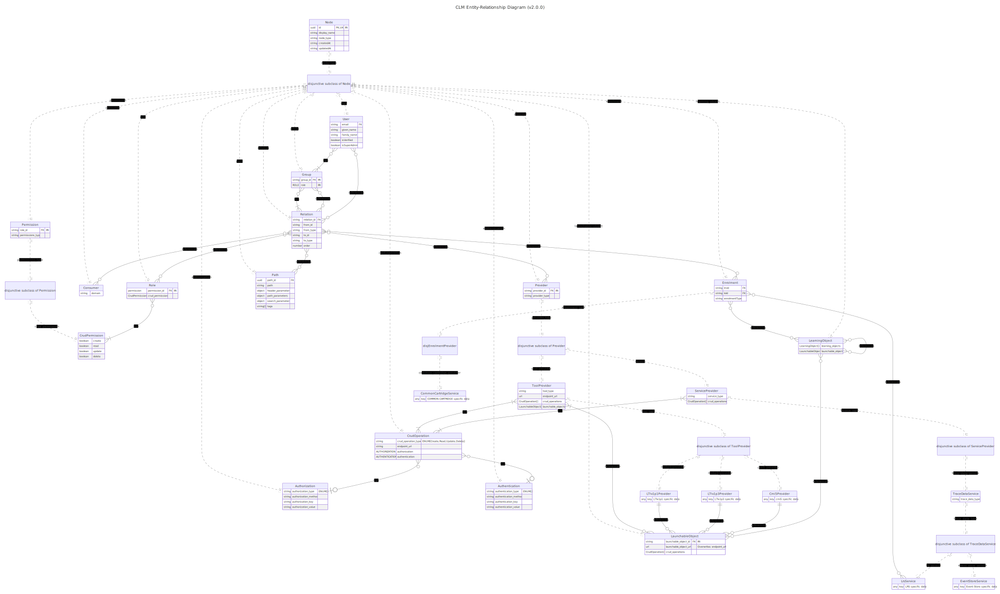

**This microservice is based upon  [clm-core](https://github.com/fraunhoferfokus/clm-core) and extends the basic functionalities with additional features**

# What is the Common Learning Middleware?

Connecting disparate learning environments into educational ecosystems using open standards is a core use case of the Common Learning Middleware (CLM). Based on the best-of-breed approach, various providers of educational offerings can connect their learning content as learning nuggets via the CLM using a publish-subscribe system in order to increase their own reach. The CLM supports common standards of a seamless educational journey - to facilitate integration - and is also able to translate from one standard of a client system to the other or the same standard of the target system at the runtime of a request. 

CLM serves as a mediator between learning platforms and learning content, while the integration of further standards enables consumers to offer extended services, such as AI-supported systems, recommender systems or learning analytics systems via the CLM.

The two videos below explain CLM from the perspective of a user and provider.

#### User
https://github.com/fraunhoferfokus/clm-core/assets/135810890/44a340ab-1d86-4930-9c08-bffe457bc222

#### Provider
https://github.com/fraunhoferfokus/clm-core/assets/135810890/87cd557e-3214-4b13-b49d-703f9eccca7d

# CLM-EXT-SWAGGER
Serves as documentation to display all routes of either clm-extensions or the clm-core. Dynamically receives the swagger configuration of the deployed microservices.

## Requirements
- MariaDB, set up locally.
- Node.js 20.x
### Folder Structure
root

├── api-docs # Open API 3.0.0 definition as .yaml file documenting all routes and data models this service offers.

├── docs # Developer documentation of all functions, classes, interfaces, types this service exposes as an npm package.

├── dist # The built TypeScript project transpiled to JavaScript.

└── src # Business-relevant logic for this web server.

### Architecture

The Entity Relationship Model of the Open Core is shown above.

## Setup for testing the webserver 

1. npm install
2. Copy .env.default to .env and overwrite needed properties

Following table gives an overview of the settings you can change through the environment variables

| Name         | Example                                         | Required (Yes/No) | Description                                                                            |
| ------------ | ----------------------------------------------- | ----------------- | -------------------------------------------------------------------------------------- |
| PORT         | 3010                                            | Yes               | The port on which the service should be deployed.                                      |
| `DEPLOY_URL` | `HOST_PROTOCOL://HOST_ADDRESS:GATEWAY_PORT/api` | Yes               | The address where all microservices are to be orchestrated. A `/api` must be appended. |

3.1 `npm run dev` for development with nodemon
3.2 `npm start` for deployment

# Swagger Documentation

- A Swagger UI is presented at the specified `DEPLOY_URL`. This UI displays all REST interfaces in Open API 3.0 format that are offered through the Open Core.

### Changelog

The changelog can be found in the [CHANGELOG.md](CHANGELOG.md) file.

## Get in touch with a developer

Please see the file [AUTHORS.md](AUTHORS.md) to get in touch with the authors of this project.
We will be happy to answer your questions at {clm@fokus.fraunhofer.de}

## License

The project is made available under the license in the file [LICENSE.txt](LICENSE.txt)

